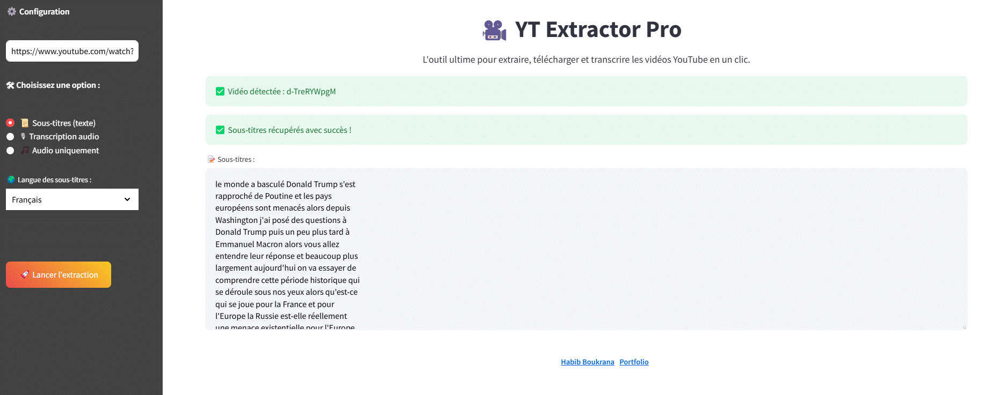

# 🎥 YT Extractor Pro

**YT Extractor Pro** est une application  permettant d'extraire, transcrire et télécharger du contenu audio depuis des vidéos YouTube.
---

## 🚀 Fonctionnalités

✅ **Extraction des sous-titres** en plusieurs langues  
🎤 **Transcription audio** avec Whisper AI  
🎧 **Téléchargement direct de l’audio** en format MP3  
🎨 **Interface élégante et intuitive** avec Streamlit  
🛠 **Nettoyage automatique des fichiers temporaires** après utilisation  

---
## 📌 Installation

### 1️⃣ Cloner le projet  
```sh
git clone https://github.com/Habib166081/yt-extractor-pro.git
cd yt-extractor-pro
```

### 2️⃣ Créer et activer un environnement virtuel  
```sh
# Sur Windows
python -m venv venv
venv\Scripts\activate

# Sur macOS/Linux
python3 -m venv venv
source venv/bin/activate
```

### 3️⃣ Installer les dépendances  
```sh
pip install -r requirements.txt
```

### 4️⃣ Lancer l'application  
```sh
streamlit run app.py
```

---

## 📸 Aperçu de l'interface  


---

## 🔗 Liens utiles  
👤 **Développeur** : [Habib Boukrana](https://www.habib-boukrana.com/)  
📂 **Dépôt GitHub** : [YT Extractor Pro](https://github.com/Habib166081/yt-extractor-pro.git)  
🔗 **LinkedIn** : [Habib Boukrana](https://www.linkedin.com/in/habib-boukrana-755479175/)  
🌐 **Portfolio** : [habib-boukrana.com](https://www.habib-boukrana.com/)  
